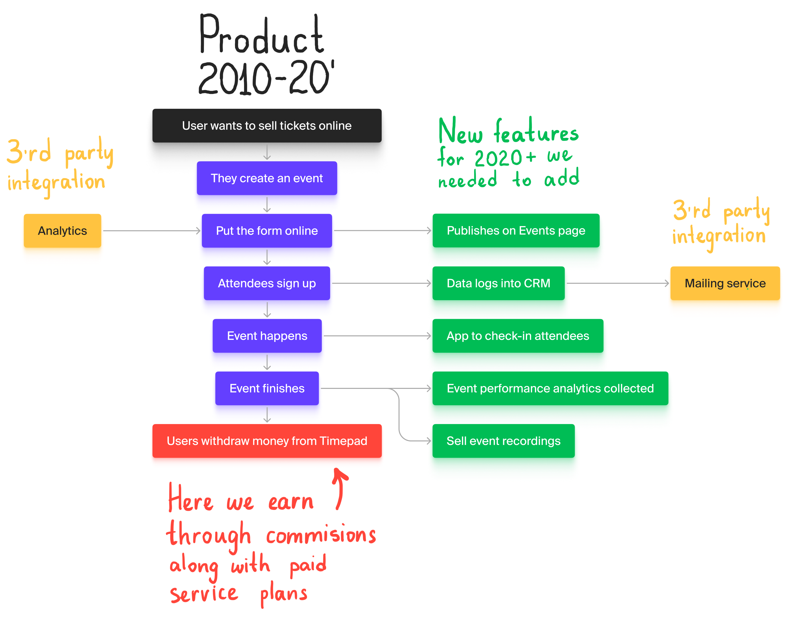

import { Image } from 'astro:assets';
import SingleImage from '../../components/SingleImage.astro';
import DoubleImage from '../../components/DoubleImage.astro';
import SingleVideo from '../../components/SingleVideo.astro';
import ImageVideo from '../../components/ImageVideo.astro';
import DoubleVideo from '../../components/DoubleVideo.astro';

import Architecture from './images/Timepad/Architecture.png';
import Navigation from './images/Timepad/Navigation.mp4';
import SystemImg from './images/Timepad/System.png';
import SystemVid from './images/Timepad/System.mp4';
import Storybook from './images/Timepad/Storybook.mp4';
import Event from './images/Timepad/Event.mp4';
import CreateEvent from './images/Timepad/CreateEvent.mp4';
import Services from './images/Timepad/Services.mp4';
import Contentt from './images/Timepad/Content.mp4';
import CRM from './images/Timepad/CRM.mp4';
import MainPage from './images/Timepad/MainPage.png';
import Settings from './images/Timepad/Settings.mp4';
import Profile from './images/Timepad/Profile.png';
import Afisha from './images/Timepad/Afisha.mp4';
import MobileProduct from './images/Timepad/MobileProduct.mp4';
import MobileAfisha from './images/Timepad/MobileAfisha.mp4';

#### Timepad is an event platform where organizers create events, and participants buy tickets. I worked as a design director there and developed strategy for redesign which I led for two years. As well as built a team and implemented new hiring pipeline.

### Reason for Redesign

The service was established in 2010 and became a leading platform for creating and attending events in its initial years. However, the design remained unchanged since then. In 2019, the service was acquired, and the new owner sought to refresh it and prepare for scaling in Eastern Europe. They assembled a new team of designers who initially focused on branding. I was brought in as a part-time contractor tasked with creating a design system and delivering daily design fixes.

While the design team proposed a complete overhaul of the service in one go, the business and development teams preferred a step-by-step approach to manage workload and analyze the impact of each step on product metrics. Understanding the desire to build cost-effective solutions, I proposed redesigning the service tab by tab, which was well-received by all stakeholders. Consequently, the previous design director left the company, and I assumed the role full-time.

### Architecture

The service addressed the simple problem of selling tickets online but catered to diverse users, including those organizing multiple events weekly, annually, or even none at all. Their marketing expertise also varied, but it was evident that users engaged in constant marketing efforts generated more revenue.

To address these complexities, we decided to retain ticket sales as the core function while integrating CRM to streamline cohort management. We introduced 'services' as add-ons for power users to enhance event analytics or export participants to mailing services. Additionally, to boost event visibility, we aimed to create a website featuring all events on the platform.

To gain a comprehensive understanding of the product, I created a screen map and mapped user stories onto it. This exercise revealed the need to reorganize features under relevant tabs based on their importance, which was determined through collaboration with support and product management teams.

<SingleImage alt="Architecture" src={Architecture} customClass="" caption='Screen map was made together with a product manager who was in charge of redesign. It came out as a useful exercise to get a common ground and guarantee a fruitful collaboration. Making a table was another useful exercise on my request to present it to CEO. It helped to shape backlog drastically.'/>

### New Layout

<SingleVideo src={Navigation} customClass="" caption='Desktop first, 12 column, responsive layout that could accomodate expanded and hidden navigation.'/>

We initiated the redesign with a new React foundation to facilitate future changes, introducing a vertical navigation system to ensure accessibility on lengthy pages.

### Design System Implementation

<ImageVideo customClass="borders" lsrc={SystemImg} lalt="Figma file with all the components" rsrc={SystemVid} caption='Design system components were carefully assembled and described in Figma, before being developed.'/>

Our goal was to seamlessly integrate the design system into React development, with all developers contributing while working on product features. To achieve this, I collaborated with the head of frontend engineering to establish a streamlined process.

<SingleVideo customClass="borders" src={Storybook} caption='Every developed component was displayed in storybook in a similar order as in Figma, to make navigation easy.'/>

The process involved the product manager creating a task, followed by the design department delivering artboards, prototypes, and detailed component descriptions. Developers then implemented the feature and deployed it on a staging server alongside components in a Storybook. Subsequently, designers reviewed the work, provided feedback, and passed the task to QA before moving it to release.

### Events

<SingleVideo customClass="borders" src={Event} caption='Event page has dashboard and dedicated tab for every data point if the user needs details.'/>

We updated the layout with a second-level navigation system to enhance event management.

<SingleVideo customClass="borders" src={CreateEvent} caption='Event creation layout has 12 colums but different element distribution to accomodate steps, forms and helpers along with progress bars.'/>

Redesigned event creation to provide concise steps, progress feedback, and hints, reflecting a different mode of interaction. This mode was later adapted for content creation.

### Content

<SingleVideo customClass="borders" src={Contentt} caption='In content creation mode we reused event page layout and event creation layout.'/>

Enabled users to sell content such as lectures and webinar recordings.

### Services

<SingleVideo customClass="borders" src={Services} caption='Relatively simple tabs had a solid foundation with our layouts and its appearance was familiar for users'/>

Introduced a tab functioning as an AppStore for useful integrations.

### Participants (CRM)

<SingleVideo customClass="borders" src={CRM} caption='Participants page served as visual interface for user database. Filtering and sorting doesn the same as database queries. And everything can be saved as a filtered view.'/>

This feature, essentially a CRM, had been requested since 2010. User feedback during the design phase indicated strong enthusiasm for the concept from the outset.

### Main Page

<SingleImage customClass="borders" alt="Timepad main page" src={MainPage} caption='Main page had everything we had already designed at this point, just in a right order to read.'/>

The main page served as a dashboard displaying upcoming events and signup progress.

### Settings

<SingleVideo customClass="borders" src={Settings} caption=''/>
<figcaption>Settings had been put inside content creation layout with a minor tweaks. The layout didn't mean to be used like that, but amount of content and how settings look in this layout made perfect sense for this usecase.</figcaption>

A straightforward section dedicated to account settings.

### Profile

<SingleImage customClass="borders" alt="Profile page" src={Profile}/>
<figcaption>Shout out to John Wilson! Watch his documentaries if you didn't.</figcaption>

The profile page, while essential, was relatively straightforward in its functionality.

### Afisha: Platform Events

<SingleVideo customClass="borders" src={Afisha}/>
<figcaption>A website where unregistered users could discover events in their cities.</figcaption>

Designed a main page, called Afisha, to showcase all platform events and ensure visibility for search engines. To make content easier to consume I provided this part of the product with more editorial than corporate design.

### Mobile Version

<DoubleVideo customClass="borders" lsrc={MobileProduct} rsrc={MobileAfisha}/>
<figcaption>Mobile layout had 6 columns and different navigation on a SaaS side.</figcaption>

We also focused on optimizing the user experience for mobile devices to ensure productivity on the go.
